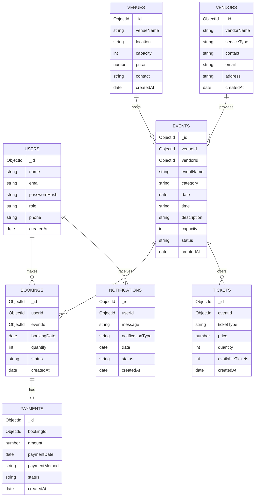

# Entity Relationship Diagram — Event Management System

## Relationship Summary

| **Relationship**     | **Cardinality** |
| -------------------- | --------------: |
| User → Bookings      |           1 : N |
| Event → Bookings     |           1 : N |
| Venue → Events       |           1 : N |
| Vendor → Events      |           1 : N |
| Event → Tickets      |           1 : N |
| Booking → Payment    |           1 : 1 |
| User → Notifications |           1 : N |
