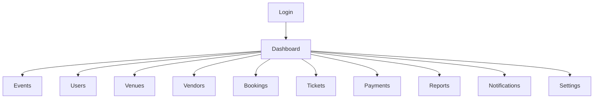
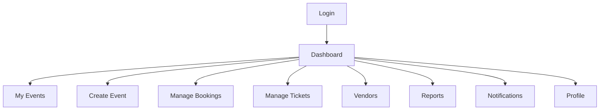
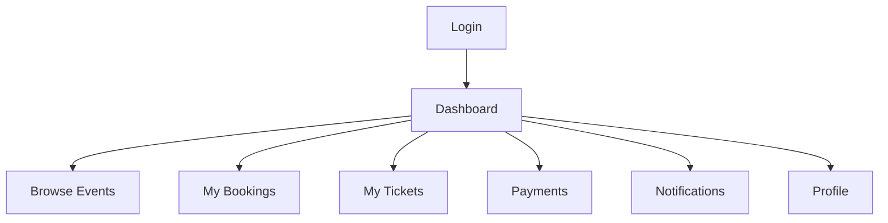
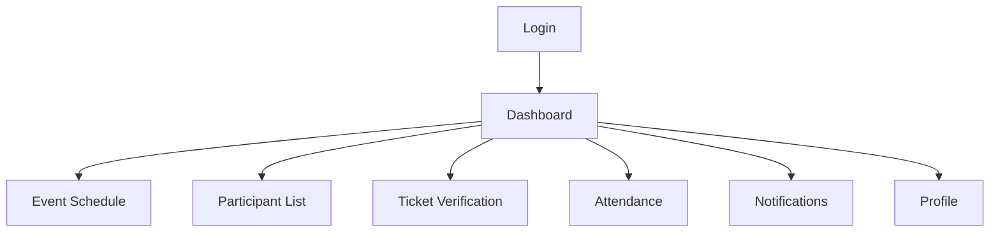
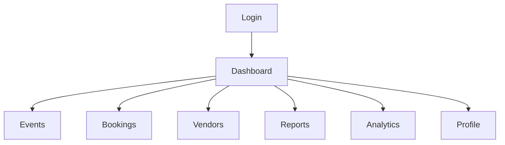

# Navigation Flow — Event Management System

## Administrator

```mermaid
graph TD
    Login --> Dashboard
    Dashboard --> Events
    Dashboard --> Users
    Dashboard --> Venues
    Dashboard --> Vendors
    Dashboard --> Bookings
    Dashboard --> Tickets
    Dashboard --> Payments
    Dashboard --> Reports
    Dashboard --> Notifications
    Dashboard --> Settings
```

## Event Organizer

```mermaid
graph TD
    Login --> Dashboard
    Dashboard --> MyEvents[My Events]
    Dashboard --> CreateEvent[Create Event]
    Dashboard --> ManageBookings[Manage Bookings]
    Dashboard --> ManageTickets[Manage Tickets]
    Dashboard --> Vendors
    Dashboard --> Reports
    Dashboard --> Notifications
    Dashboard --> Profile
```

## Participant

```mermaid
graph TD
    Login --> Dashboard
    Dashboard --> BrowseEvents[Browse Events]
    Dashboard --> MyBookings[My Bookings]
    Dashboard --> MyTickets[My Tickets]
    Dashboard --> Payments
    Dashboard --> Notifications
    Dashboard --> Profile
```

## Event Staff / Volunteer

```mermaid
graph TD
    Login --> Dashboard
    Dashboard --> EventSchedule[Event Schedule]
    Dashboard --> ParticipantList[Participant List]
    Dashboard --> TicketVerification[Ticket Verification]
    Dashboard --> Attendance
    Dashboard --> Notifications
    Dashboard --> Profile
```

## Organization Manager

```mermaid
graph TD
    Login --> Dashboard
    Dashboard --> Events
    Dashboard --> Bookings
    Dashboard --> Vendors
    Dashboard --> Reports
    Dashboard --> Analytics
    Dashboard --> Profile
```
