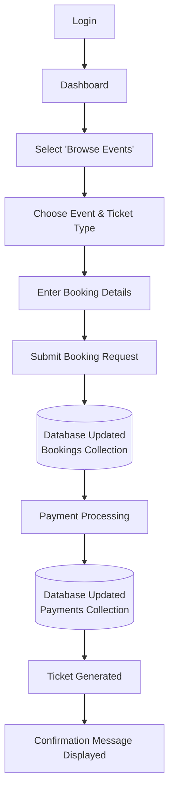

# Application Workflow — Event Management System

Example: booking an event.

## Step-by-Step

1. **Login** — user authenticates with email and password and accesses the Event Management System.

2. **Dashboard** — user lands on their role-specific dashboard and can access available events.

3. **Select "Browse Events"** — participant navigates to the event listing page to view available events.

4. **Choose Event & Ticket Type** — participant selects an event and chooses the required ticket type and quantity.

5. **Enter Booking Details** — participant provides the required booking information.

6. **Submit Booking Request** — booking data is sent to the backend through a `POST /api/bookings` request.

7. **Database Updated** — a new document is created in the `Bookings` collection containing the user, event, booking date, quantity, and booking status.

8. **Payment Processing** — the participant proceeds with the payment for the selected booking.

9. **Database Updated** — payment information is stored in the `Payments` collection with the booking ID, amount, payment method, and payment status.

10. **Ticket Generated** — after successful booking and payment, an event ticket is generated for the participant.

11. **Confirmation Message Displayed** — the frontend displays a booking confirmation and the ticket becomes available under **My Tickets**.
